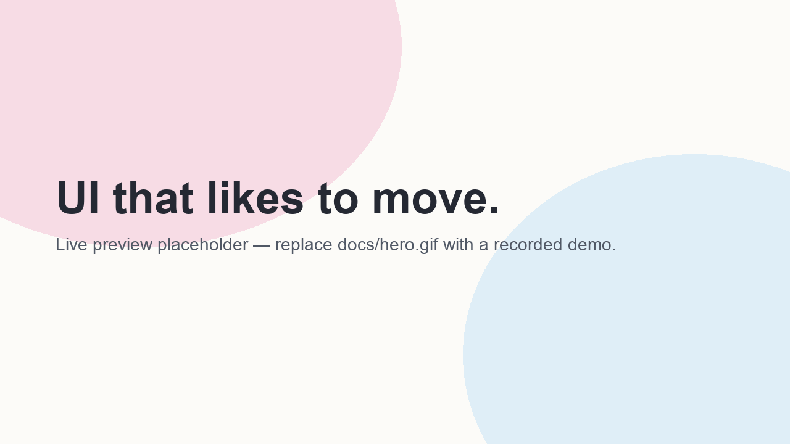

# Pinky UI

[](https://pinkyui.com)

Website: https://pinkyui.com



**An open-source React interaction and UI system for modern interfaces.**

Pinky UI is an open-source collection of expressive React components, product systems and motion primitives built for interfaces that feel responsive, tactile and alive.

Pinky UI `0.1.0` is available from source today. The nine `@pinky-ui/*` packages — primitives,
components, layouts, effects, experiences, systems, registry, ai-ui and mobile — are prepared
for public release but are not published to npm yet. A tenth package, the `pinky-ui` CLI, installs
individual components as source code into your own project rather than as a library dependency —
it's deliberately not under the `@pinky-ui/*` scope, since it isn't one of the interaction packages
itself.

Explore jelly, liquid, magnetic, morph, glow, depth, elastic and proximity interactions —
**313 implemented items across 12 primitives, 34 components, 28 layouts, 37 effects, 32
experiences and 170 product and workflow systems** — designed to stay composable, accessible
and practical to use. The website puts those interactions directly in front of you as live
previews instead of hiding the work behind a documentation-first catalogue.

Every item listed on the site has an implemented source entry and an import path. Nothing is
documented before it exists, and the registry in `packages/registry` is the single source of
the counts above.

React · TypeScript · Tailwind CSS · Motion · Accessible · Open Source

## Get started

Pinky UI is currently developed from source; the `@pinky-ui/*` packages have publish-like build
metadata and packed artifacts, but are not published npm packages yet. After npm publication,
the package READMEs will show the normal registry installation commands.

```bash
git clone https://github.com/florash/Pinky-UI.git
cd Pinky-UI
npm install
npm run dev
```

Open http://localhost:3000 for the interaction wall or /docs for the usage guide.

For a production build, set `NEXT_PUBLIC_SITE_URL` to the public `http` or `https` origin so
canonical URLs, Open Graph metadata, sitemap and robots output point at the deployed site.

## Styling

The website owns the Tailwind CSS configuration and Pinky design tokens in
`apps/website/src/app/globals.css`; the source packages do not currently publish a standalone
CSS or token entrypoint. The site loads Montserrat and Geist through `next/font`; the packages do
not bundle font files.

## Why Pinky UI?

- Interaction-first React components
- Reusable motion primitives you can compose yourself
- Subtle animation tuned for real products, not demos
- Reduced-motion aware: motion is the enhancement, never the content
- Designed for composition rather than rigid themes
- Zero WebGL dependency — every effect, including the spatial and 3D-feeling ones, is CSS and
  `transform` under the hood: no `<canvas>`, no shader runtime, no low-end-device fallback to write

## What's inside

### Primitives — `@pinky-ui/primitives`

| Primitive | What it does |
| --- | --- |
| `Magnetic` | Pulls its child toward the pointer, with smooth falloff and a hard travel cap |
| `Jelly` | Elastic lean, drift and settle, with squash and stretch on press |
| `Tilt` | Rigid perspective tilt with an optional specular highlight |
| `Morph` | Expands one surface into another as a single object, with dialog semantics |
| `LiquidSurface` | Translucent surface with pointer-tracked highlight and refracting edge |
| `Proximity` | One shared pointer subscription giving each item a springed 0–1 closeness |
| `Spotlight` | Lights the face of a surface under the pointer |
| `Parallax` | Layered depth from one shared pair of motion values |
| `usePressSpring` | Press feedback that answers pointer and keyboard alike |
| `Spring` | The shared motion vocabulary, plus hover, focus and press feedback |
| `CursorGlow` | Ambient light that follows the pointer across a region |
| `usePointerGlow` | Writes pointer position into CSS variables, so lighting stays pure CSS |

## Components

- Basic Card
- Media Card
- Horizontal Card
- List Card
- Jelly Card
- Liquid Card
- Morph Card
- Spotlight Card
- Tilt Card
- Magnetic Button
- Ripple Button
- Glow Border
- Fluid Tabs
- Pill Nav
- Gooey Menu
- Floating Dock
- Elastic Toggle

```tsx
import { MagneticButton } from "@pinky-ui/components";

<MagneticButton strength={0.4}>Explore components</MagneticButton>
```

## Layouts

Ways to arrange many things, where the arrangement itself is the interaction.

- Polaroid Wall
- Stack to Grid
- Masonry Gallery
- Scroll Morph Wall
- Draggable Card Stack
- Expandable Bento
- Card Fan

```tsx
import { PolaroidWall, StackGrid } from "@pinky-ui/layouts";
```

The layouts package also includes an editorial family
(Editorial Mosaic, Gallery ↔ List Morph, Split-Screen Gallery, Cinematic
Horizontal Gallery, Broken / Offset Grid, Layered Editorial, Floating Columns)
and a spatial family (Perspective Bento, Curved 3D Grid, Helix Gallery, Cylinder
Gallery, Depth Scroll Gallery, Spatial Card Tunnel, Stack → Spatial, Infinite
Spatial Canvas). All 28 layouts are implemented; see `packages/registry/src/layouts.ts`.

The spatial layouts use CSS 3D transforms and Motion only — there is no WebGL,
Three.js or React Three Fiber anywhere in this repository. The full runtime
dependency list is `motion`, `next`, `react` and `react-dom`.

## Skills

Pinky UI ships **agent-readable interaction Skills**: **283 canonical Markdown recipes across
284 public Skill routes** in `packages/skills`. One route is an intentional legacy alias kept
for compatibility. The recipes cover individual items and system-level guidance on interaction
density, reduced motion, landing-page motion, choosing a card, and composition.

Five primitives (`spring`, `parallax`, `press-spring`, `cursor`, `glow`) do not
have skills yet. They are public API, not internals.

The website renders those files directly, so there is no second copy to fall out
of date.

## Repository

```text
apps/website         Next.js site — components, layouts, playground, skills
packages/primitives  Interaction primitives
packages/components  Components built on top of the primitives
packages/layouts     Galleries, grids, stacks, editorial and spatial layouts
packages/effects     Cursor, motion, text and scroll effects
packages/experiences Navigation, heroes, backgrounds, transitions, spatial UI
packages/systems     Media, forms, data and product workflow systems
packages/registry    Metadata describing every item in the library
packages/skills      Agent-readable Skills (items + patterns)
examples/            Small standalone compositions
```

The website compiles `packages/*` straight from TypeScript source through the
path aliases in `apps/website/tsconfig.json`, so editing a primitive shows up on
the site with no build step in between. `npm run build:packages` creates the
publish-like package artifacts, and `npm run verify:release` runs the full release
gate. There is no npm publication or CLI yet; the repository remains the current
source and documentation surface.

## Local development

```bash
npm install
```

```bash
npm run dev
```

Then open `http://localhost:3000`.

Other scripts: `npm run build`, `npm run typecheck`, `npm run lint`, `npm test`.

ESLint uses a flat config (`eslint.config.mjs`) with the Next plugin. Tests run
on Vitest with Testing Library.

## Accessibility

Every primitive reads `prefers-reduced-motion` and renders a complete, usable UI
when motion is disabled. Interactive components remain keyboard operable and
carry their own focus and ARIA semantics.

## Mobile and touch

Mobile is treated as an interaction input, not a narrower desktop layout. Touch-first systems
use thumb-sized targets, visible non-hover fallbacks, contained gestures and safe-area-aware
bottom surfaces. The `/mobile` wall and the Mobile family in `/workflows` show the live examples.

## Contributing

See [CONTRIBUTING.md](CONTRIBUTING.md) for the local checks, Skill recipe workflow and
accessibility expectations.

## License

MIT
